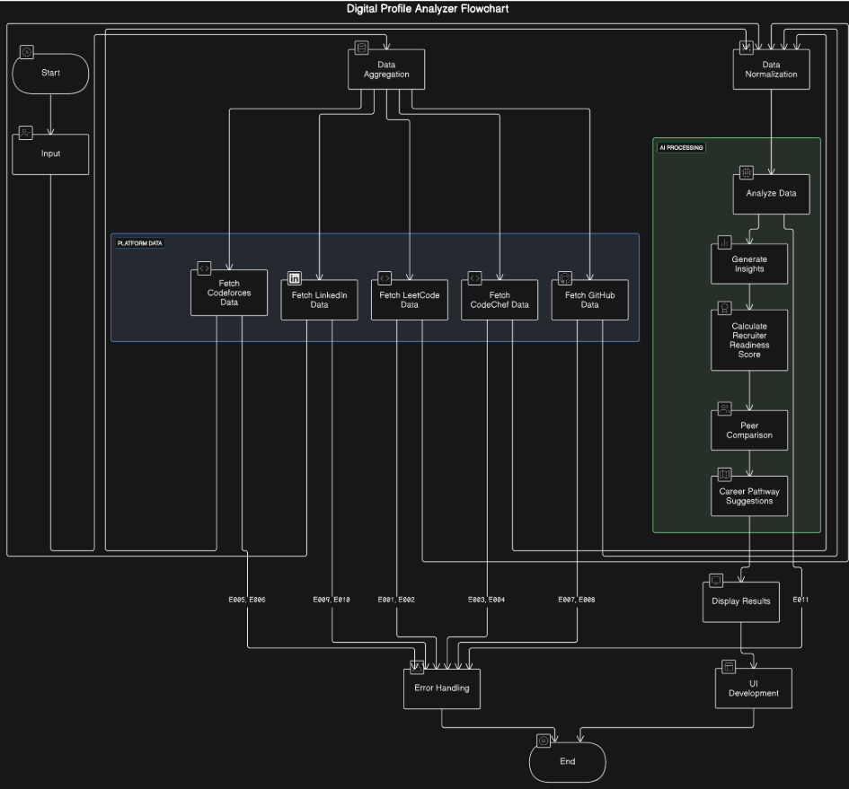

# 💼 DigiAnalyzer: AI-Powered Digital Profile Analyzer

> 🚀 An intelligent platform to evaluate and enhance developer profiles by aggregating data from GitHub, LinkedIn, LeetCode, Codeforces, and CodeChef. This tool helps recruiters make informed decisions and developers optimize their digital presence.

---

## 📑 Index
- [🧠 Problem Statement](#-problem-statement)
- [❗The Challenge](#the-challenge)
- [🎯 Solution](#-solution)
- [✨ Key Features](#-key-features)
- [🗂️ Project Structure](#️-project-structure)
- [🧱 System Architecture](#-system-architecture)
- [🔌 Data Sources](#-data-sources)
- [📥 Getting Started](#-getting-started)
- [📄 API Overview](#-api-overview)
- [🧠 AI Model Used](#-ai-model-used)
- [📊 Evaluation Metrics Used in Technical Profile Assessment](#-evaluation-metrics-used-in-technical-profile-assessment)
  - [🔍 **1. Profile Overview and Platform Summary**](#-1-profile-overview-and-platform-summary)
  - [💡 **2. Insight Generation**](#-2-insight-generation)
  - [💼 **3. Recruiter Readiness Evaluation**](#-3-recruiter-readiness-evaluation)
  - [👔 **4. LinkedIn and Social Activity Analysis**](#-4-linkedin-and-social-activity-analysis)
  - [👥 **5. Peer Contextualization**](#-5-peer-contextualization)
  - [🚀 **6. Career Pathway Suggestions**](#-6-career-pathway-suggestions)
- [👨‍💻 Tech Stack](#-tech-stack)
- [🛠 Future Enhancements](#-future-enhancements)
- [🎥 Demo Video](#-demo-video)
- [🌐 Deployed App](#-deployed-app)
- [📄 License](#-license)

---

## 🧠 Problem Statement

In today’s competitive job market, a strong digital presence is essential. Recruiters often assess candidates through coding platform stats, GitHub activity, and LinkedIn engagement. However, evaluating each profile manually is inconsistent and time-consuming.

---

## ❗The Challenge

- **Lack of Visibility:** Developers struggle to understand how their profiles appear to recruiters.
- **No Standardized Evaluation:** No clear metric to compare skills across platforms.
- **Missing Insights for Improvement:** No guidance for profile enhancement.

---

## 🎯 Solution

DevHeat is an **AI-powered Digital Profile Analyzer** that:

- Aggregates data from top developer platforms.
- Scores and analyzes candidate profiles.
- Provides actionable insights and personalized improvement suggestions.
- Benchmarks candidates against peers.

---

## ✨ Key Features

- 🔍 **Data Aggregation**: Automatically scrapes and normalizes data from GitHub, LinkedIn, LeetCode, Codeforces, and CodeChef.
- 📊 **Profile Scoring**: Analyzes activity, skills, strengths, and diversity.
- 🧠 **Insight Generation**: Offers detailed analysis of areas to improve.
- ✅ **Recruiter Readiness Score**: Calculates hiring potential on a scale of 100.
- 🧑‍🤝‍🧑 **Peer Comparison**: Compares candidates with top developers.
- 🎯 **Career Suggestions**: Recommends personalized pathways for career growth.

---

## 🗂️ Project Structure

```
.
├── client/
│   ├── public/
│   └── src/
│       ├── assets/
│       ├── components/
│       ├── pages/
│       ├── App.jsx
│       ├── main.jsx
│       └── index.css
├── server/
│   ├── src/
│   │   ├── assets/
│   │   │   └── prompt.js
│   │   ├── routes/
│   │   │   └── endpoints.js
│   │   └── utilities/
│   │       ├── codechef.js
│   │       ├── codeforces.js
│   │       ├── github.js
│   │       ├── gemini.js
│   │       ├── gpt.js
│   │       ├── insights.js
│   │       ├── leetcode.js
│   │       ├── linkedin.js
│   │       └── server.js
├── plan.md / plan.pdf
├── req.http
├── test.js / test1.js
```

---

## 🧱 System Architecture


---

## 🔌 Data Sources

- **LeetCode**: Problems solved, contest ratings, heatmap, skills, languages.
- **Codeforces**: Rating, tag-based problem-solving history.
- **CodeChef**: Rating, contest stats.
- **GitHub**: Repositories, stars, forks, tech stack, contributions, PRs.
- **LinkedIn**: Resume, posts, skills, connections, certifications, engagement.

---

## 📥 Getting Started

```bash
git clone https://github.com/your-username/devheat.git
cd devheat

# Start backend
npm install
npm start

# Start frontend
cd client
npm install
npm run dev
```

---

## 📄 API Overview

| Endpoint           | Method | Description                  |
|--------------------|--------|------------------------------|
| `/api/analyze`     | POST   | Accepts usernames |
| `/api/response`      | GET    | Get analyzed data          |
| `/api`    | GET    | Landing page       |
| ...                | ...    | ...                          |

---

## 🧠 AI Model Used

- **Gemini**: For generating insights, scoring logic, personalized suggestions.

---

## 📊 Evaluation Metrics Used in Technical Profile Assessment

The assistant evaluates a candidate's technical and professional presence across multiple platforms using the following parameters and structured criteria:

### 🔍 **1. Profile Overview and Platform Summary**
- Interpretative summary across platforms (LeetCode, CodeChef, Codeforces, GitHub, LinkedIn)
- Depth of engagement, skill diversity, practical experience, and growth trajectory
- Platform-wise breakdown:
  - Key activities and highlights
  - Unique strengths
  - Gaps or underutilized areas
  - Behavioral patterns (e.g., contest consistency, repo updates)

### 💡 **2. Insight Generation**
- Core strengths and technical excellence
- Emerging patterns in behavior and skill growth
- Standout achievements (e.g., high contest ratings, open-source wins)
- Areas with potential that require more focus
- Clear presentation through bullet points or tables

### 💼 **3. Recruiter Readiness Evaluation**
- Portfolio quality and real-world project utility
- Skill visibility across platforms and ReadMes
- Activity consistency and personal branding
- Actionable suggestions for improving reach and impact

### 👔 **4. LinkedIn and Social Activity Analysis**
- Profile completeness and compelling storytelling
- Post consistency, engagement, and meaningfulness
- Showcasing work (projects, certificates, media)
- Networking behavior and professional interactions
- Tips to boost visibility and credibility

### 👥 **5. Peer Contextualization**
- Performance relative to peers based on:
  - Project quality
  - Language proficiency
  - Social/professional activity
  - Problem-solving strength
- Avoids generic comparisons; uses context-specific insights

### 🚀 **6. Career Pathway Suggestions**
- Career roles aligned with current skills and activity
- Project and contribution recommendations
- Suggested tools, platforms, communities, and certifications to grow

---

## 👨‍💻 Tech Stack

- **Frontend**: React, TailwindCSS
- **Backend**: Node.js, Express
- **AI Integration**: Gemini / OpenAI
- **Scraping & APIs**: Custom scripts + platform APIs
- **Other Tools**: HTTP clients (e.g., req.http), JSON formatter

---

## 🛠 Future Enhancements

- Add support for more platforms (HackerRank, GFG).
- Recruiter dashboard for bulk evaluations.
- Export reports as PDF.
- OAuth-based login for authenticated analysis.

---

## 🎥 Demo Video

> 📺 Watch the walkthrough here:  
[Project Demo Video](https://youtu.be/Q09HCMFOjmY)

---

## 🌐 Deployed App

> 🔗 Check out the live app here:  
[https://profile-analyzer-drab.vercel.app/](https://profile-analyzer-drab.vercel.app/)  

---

## 📄 License

[MIT License](LICENSE)

---